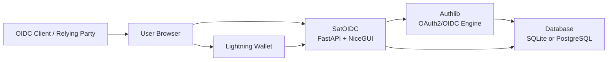

<p align="center">
  
</p>

<h1 align="center">SatOIDC</h1>

<p align="center">
  <strong>Satoshi OpenID Connect Provider</strong><br />
  Identity, OAuth2/OIDC and Lightning-native authentication for Bitcoin-first applications.
</p>

<p align="center">
  <a href="LICENSE"></a>
  
  
  
</p>

---

## Overview

**SatOIDC** is an OpenID Connect 1.0 Provider that combines traditional federated identity with Bitcoin/Lightning authentication through LNURL-auth.

The project implements an **OpenID Provider (OP)** with:

- OAuth2 Authorization Code Flow with OpenID Connect support.
- ID Token issuance with JWT/JWKS.
- PKCE support for public clients.
- UserInfo, discovery, introspection and revocation endpoints.
- Password-based login plus LNURL-auth login/registration flows.
- NiceGUI web interface for onboarding, login, consent, profile and client management.

SatOIDC is currently a **beta implementation**. The codebase already contains the main protocol and UI building blocks, while the roadmap focuses on production hardening, tests, key management and permission consistency.

---

## Interface

The web UI is built with **NiceGUI** and follows the project interface conventions in [DESIGN.md](DESIGN.md).

Current screens include:

- Home and onboarding.
- Login with password or Lightning wallet.
- Account registration with terms acceptance.
- OAuth2/OIDC consent screen.
- User profile and wallet status.
- Developer/admin dashboard foundations.
- OAuth2 client registration.

> Screenshots are not committed yet. The UI can be reviewed locally after running the development server.

---

## Architecture



Main implementation areas:

- `satoidc/satoidc/auth/`: OAuth2/OIDC, security and LNURL-auth helpers.
- `satoidc/satoidc/fastapi_oauth2/`: FastAPI/Starlette adapter for Authlib.
- `satoidc/satoidc/routes/`: FastAPI and NiceGUI routes.
- `satoidc/satoidc/models/`: SQLAlchemy models.
- `satoidc/migrations/`: Alembic migrations.
- `examples/`: relying-party client examples. See [examples/README.md](examples/README.md).
- `satoidc/`: Poetry project root. See [satoidc/README.md](satoidc/README.md).

For a deeper technical map, start from [docs/README.md](docs/README.md), especially [docs/project-analysis.md](docs/project-analysis.md) and [docs/architecture.md](docs/architecture.md).

---

## Protocol Support

| Capability | Status | Notes |
| --- | --- | --- |
| OAuth2 Authorization Code | Implemented | Main supported flow. |
| OpenID Connect ID Token | Implemented | Signed with RS256 in current metadata. |
| PKCE | Implemented | Required for the Authorization Code Grant. |
| Discovery | Implemented | Served at `/.well-known/openid-configuration`. |
| JWKS | Implemented | Current key is generated at process startup. |
| UserInfo | Implemented | Returns claims based on granted scopes. |
| Introspection | Implemented | Authlib endpoint registered. |
| Revocation | Implemented | Authlib endpoint registered. |
| Refresh Token Grant | Implemented | Registered with refresh token issuance enabled and covered by focused tests. |
| LNURL-auth | Implemented | Login, register, link and auth actions exist. |
| Implicit/Hybrid | Not advertised | Not registered for the current provider contract. |

---

## Endpoints

| Endpoint | Description |
| --- | --- |
| `/authorize` | Authorization consent page. |
| `/oauth/authorize` | Authorization decision POST. |
| `/oauth/token` | Token endpoint. |
| `/oauth/userinfo` | UserInfo endpoint. |
| `/oauth/introspect` | Token introspection endpoint. |
| `/oauth/revoke` | Token revocation endpoint. |
| `/.well-known/openid-configuration` | OIDC discovery metadata. |
| `/.well-known/jwks.json` | Public signing keys. |
| `/auth/lnurl/callback` | LNURL-auth wallet callback. |

---

## Quick Start

```bash
git clone https://github.com/Sats-Lottu/satoidc.git
cd satoidc/satoidc
poetry install
poetry run alembic upgrade head
poetry run task run
```

The development server is available at:

```text
http://localhost:8000
```

The first deployment path should run the setup wizard to create a root user when no root permission exists.

---

## Configuration

Create a `.env` file inside `satoidc/` for local development:

```env
DATABASE_URL=sqlite+aiosqlite:///satoidc.db
SYNC_DATABASE_URL=sqlite:///satoidc.db
OAUTH2_JWT_ISS=http://localhost:8000
OAUTH2_JWT_ALG=RS256
OAUTH2_TOKEN_EXPIRES_IN=300
SESSION_MIDDLEWARE_SECRET_KEY=CHANGE_ME_TO_A_LONG_RANDOM_SECRET
```

For production-like deployments, configure PostgreSQL and strong secrets through the environment.

---

## Docker Compose

```bash
docker compose up --build
```

The compose stack starts:

- PostgreSQL 16.
- SatOIDC with migrations, setup wizard and FastAPI runtime on `http://localhost:8000`.

The stack reads optional overrides from `.env`; use `.env.example` as the baseline for ports, database credentials and secrets. PostgreSQL has a healthcheck, so the application waits for the database before running migrations.

---

## OIDC Discovery

```bash
curl http://localhost:8000/.well-known/openid-configuration
```

Expected metadata includes:

```json
{
  "issuer": "http://localhost:8000",
  "authorization_endpoint": "http://localhost:8000/authorize",
  "token_endpoint": "http://localhost:8000/oauth/token",
  "userinfo_endpoint": "http://localhost:8000/oauth/userinfo",
  "jwks_uri": "http://localhost:8000/.well-known/jwks.json",
  "response_types_supported": ["code"],
  "grant_types_supported": ["authorization_code", "refresh_token"],
  "id_token_signing_alg_values_supported": ["RS256"],
  "code_challenge_methods_supported": ["S256"]
}
```

---

## Client Examples

NiceGUI relying-party examples are available in [examples](examples/):

| Example | Focus |
| --- | --- |
| `basic_client.py` | Confidential client using `client_secret`. |
| `public_client.py` | Public client using PKCE and `token_endpoint_auth_method=none`. |

Public client example:

```bash
cd satoidc
poetry run task start_public_client <client-id>
```

---

## Tests And Validation

```bash
cd satoidc
poetry run task test
```

The default test task excludes tests marked `e2e`. Time-sensitive behavior such as authorization-code expiration, refresh-token windows and LNURL challenge expiration is covered with `freezegun`.

Browser e2e tests are separate from the default test task:

```bash
cd satoidc
poetry run task playwright_install
poetry run task test_e2e
```

Useful sanity check:

```bash
cd satoidc
poetry run python -m compileall satoidc setup_wizard tests
```

---

## Roadmap

### Current State

- [x] FastAPI/NiceGUI application shell.
- [x] SQLAlchemy models and Alembic migration baseline.
- [x] OAuth2/OIDC Authorization Code foundation.
- [x] OIDC discovery, JWKS and UserInfo endpoints.
- [x] LNURL-auth login/register callback flow.
- [x] Setup wizard for initial root user.
- [x] NiceGUI relying-party examples.
- [x] Spec-Driven Development workspace in `specs/`.
- [x] Project architecture and risk documentation in `docs/`.
- [x] Unit/integration test baseline for validators, OAuth/OIDC metadata, grants, LNURL-auth, setup wizard, security helpers and time-sensitive behavior.
- [x] Browser e2e smoke/responsive test baseline for public pages and well-known endpoints.

### Production Hardening

- [ ] Expand full OAuth browser authorization-code e2e coverage, including real client redirects and token exchange.
- [ ] Replace process-local JWT signing key with persistent key material and a key-rotation plan.
- [ ] Normalize the permission model across enum, migration, UI and access checks.
- [ ] Harden login redirect handling and add regression tests for open redirect prevention.
- [ ] Revisit LNURL challenge lifecycle so invalid signatures do not consume valid challenges.
- [ ] Broaden refresh token issuance and revocation coverage into end-to-end client flows.
- [ ] Make session/cookie settings production-aware, including HTTPS-only cookies.

### Product And Developer Experience

- [ ] Finish profile account actions: nickname, email, password and wallet link/unlink.
- [ ] Finish developer dashboard and OAuth2 client management.
- [ ] Add client metadata validation for redirect URIs, scopes, grant types and auth methods.
- [ ] Add screenshots to this README once the UI stabilizes.
- [ ] Normalize text encoding in README/examples/legal docs where mojibake appears.

### Future Protocol Work

- [ ] Publish a stable OIDC contract and conformance checklist.
- [x] Expose discovery at root `/.well-known/openid-configuration`.
- [ ] Evaluate Nostr identity integration.
- [ ] Revisit implicit/hybrid support before advertising those flows.
- [ ] Track Authlib/FastAPI ecosystem support and simplify the adapter layer when viable.

---

## Security Notes

- Use HTTPS in production.
- Use strong environment secrets.
- Persist and rotate signing keys before production use.
- Treat local SQLite files and NiceGUI storage as development state.
- Review [docs/known-issues.md](docs/known-issues.md) before production deployment.

---

## Project Methodology

SatOIDC uses:

- [AGENTS.md](AGENTS.md) for agent-facing project instructions.
- [DESIGN.md](DESIGN.md) for web interface conventions.
- [docs](docs/README.md) for architecture, analysis and known issues.
- [specs](specs/README.md) and [specs/index.md](specs/index.md) for Spec-Driven Development.
- [agent-memory](agent-memory/index.md) for durable project memory.

---

## License

MIT License. See [LICENSE](LICENSE).

---

## Philosophy

> Don't trust. Verify.

SatOIDC aims to connect traditional federated identity with individual sovereignty principles inspired by Satoshi Nakamoto.
