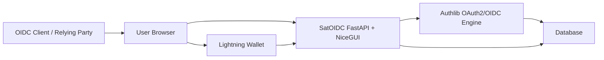
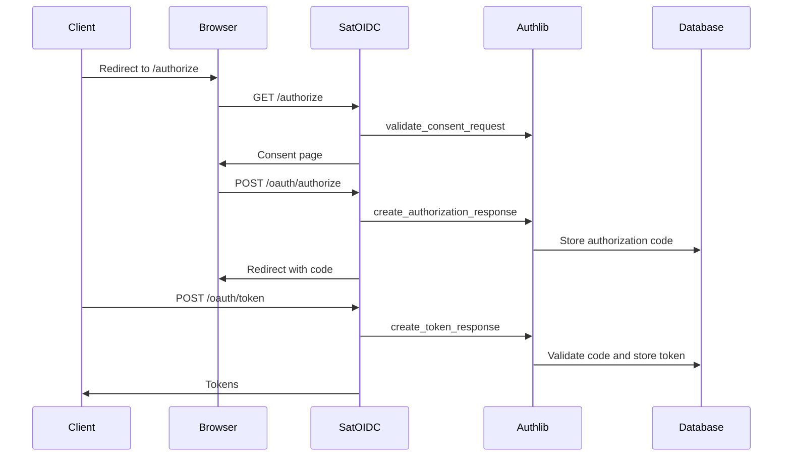
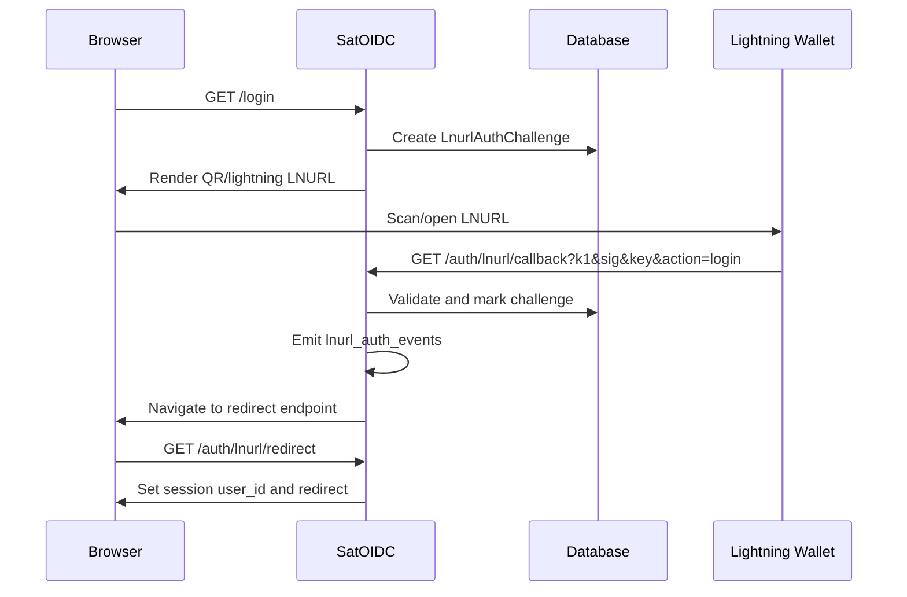
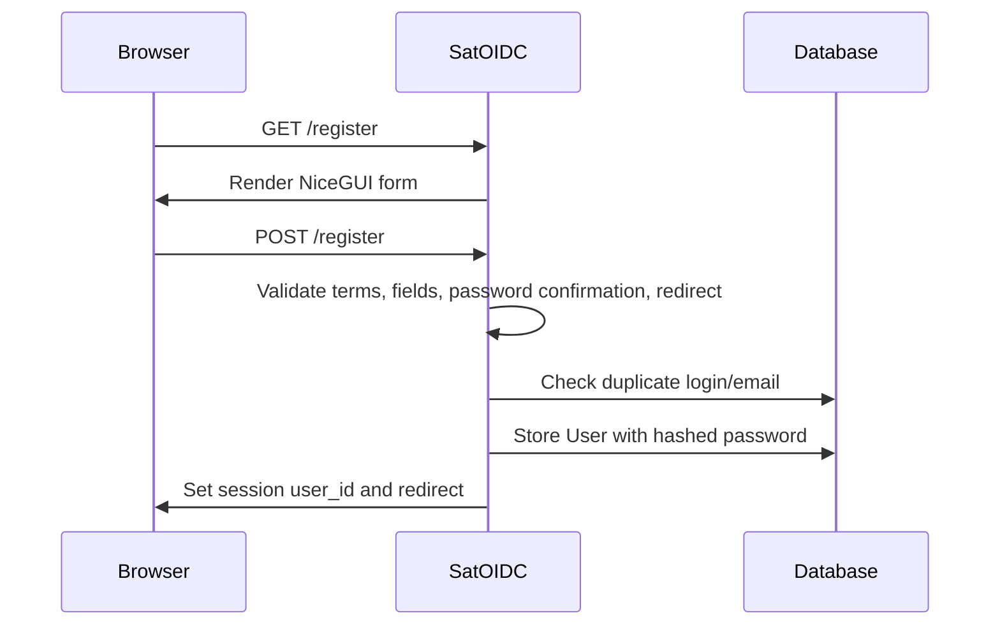

# Architecture

Updated: 2026-05-08

## System Context

SatOIDC acts as an OpenID Provider. Relying-party clients redirect users to SatOIDC, SatOIDC authenticates users through password or LNURL-auth, then Authlib issues OAuth2/OIDC artifacts.

## Main Components

### FastAPI Application

Created in `satoidc/satoidc/main.py`.

Responsibilities:

- Compose middleware.
- Configure Authlib.
- Register routes.
- Attach NiceGUI UI to FastAPI.

### NiceGUI UI

Routes in `satoidc/satoidc/routes/` define pages directly with NiceGUI.

Primary pages:

- Home.
- Register.
- Login.
- Profile.
- OIDC consent.
- OAuth client creation.
- Admin/developer dashboards.

### Authlib Integration

SatOIDC uses Authlib's SQLAlchemy OAuth2 mixins and custom grant classes.

Local adapter files in `satoidc/satoidc/fastapi_oauth2/` bridge Starlette `Request` objects into Authlib's synchronous request abstractions.

### Persistence

The project uses:

- Async SQLAlchemy sessions for FastAPI route dependencies.
- A sync SQLAlchemy session for Authlib helper functions.

Both must point to the same database through `DATABASE_URL` and `SYNC_DATABASE_URL`.

### Schemas

Request and form schemas live in `satoidc/satoidc/schemas/`.

Current schema modules:

- `lnurl.py`: LNURL callback query schema.
- `login.py`: password login form schema.
- `register.py`: password registration form schema.

The old `auth/lnurl_schemas.py` path remains as a compatibility re-export.

### LNURL-auth

LNURL-auth is implemented with challenge records, bech32 LNURL generation, secp256k1 signature verification, and NiceGUI event callbacks.

## Request Flow: Authorization Code

## Request Flow: LNURL Login

## Request Flow: Password Registration

## Security Boundaries

- Middleware protects non-public paths by checking `request.session["user_id"]`.
- `page_security` adds permission checks for selected NiceGUI pages. It validates session UUID shape, loads active non-disabled permissions, ignores expired permissions, treats `root` as all-powerful, and redirects unauthorized users to `/forbidden`.
- OAuth consent POST validates session and CSRF token.
- Password registration sanitizes `redirect_to` before redirecting.
- LNURL callback validates challenge freshness, action, replay flag, and signature.
- Production deployment must configure strong secrets, persistent signing keys, HTTPS, secure cookies, and database-backed runtime state.
