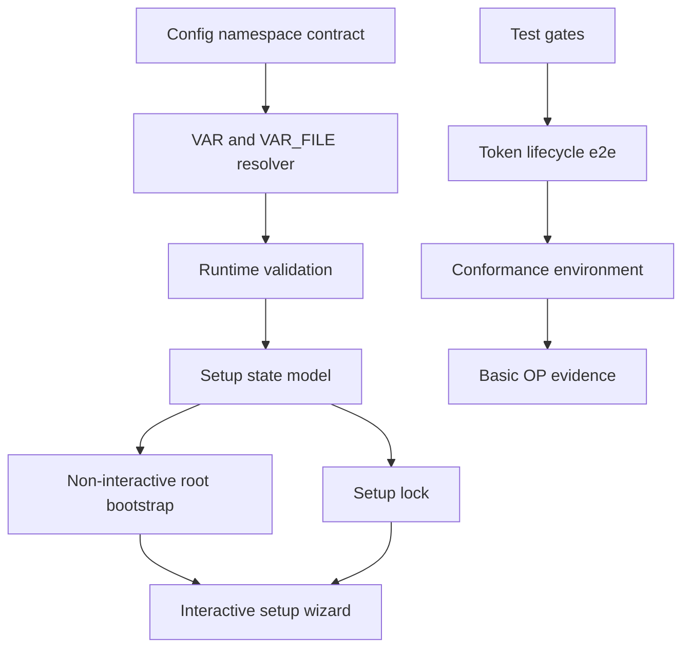

# Priority Execution Tasks

Updated: 2026-05-18

This folder contains temporary execution task files for production-readiness
work. Each file is intended to be assigned to one or more specialized agents.

Lifecycle:

1. Pick one task file.
2. Execute only the scoped work in that file.
3. Run the validation commands listed by the task.
4. Update durable docs or specs when the implementation changes behavior.
5. When the task file is fully completed, remove it from this folder.
6. Summarize the completed work in `docs/priority-execution-history.md`.
7. Keep `docs/priority-execution-backlog.md` aligned with the remaining files.

Agent rules:

- Treat each task as isolated unless dependencies are listed.
- Do not edit unrelated task files.
- Do not edit migrations by hand unless the task explicitly says so.
- For database schema changes, generate Alembic migrations with autogenerate.
- For auth, OIDC, LNURL, secrets, or session changes, add focused regression
  tests and check that logs do not leak sensitive values.
- For NiceGUI UI changes, follow `DESIGN.md` and add e2e coverage when layout
  or behavior changes.

## Execution Files

| File | Phase | Priority | Main Agent |
| --- | --- | --- | --- |
| [multiagent-execution-strategy.md](multiagent-execution-strategy.md) | Coordination | P0 | Coordinator |
| [phase-2-admin-safety-scale.md](phase-2-admin-safety-scale.md) | Admin hardening | P1/P2 | NiceGUI/backend |
| [phase-3-setup-config-bootstrap.md](phase-3-setup-config-bootstrap.md) | Setup Wizard | P1 | Backend config/security |
| [phase-3-setup-wizard-ui.md](phase-3-setup-wizard-ui.md) | Setup Wizard | P2/P3 | NiceGUI/security |
| [phase-4-token-conformance-performance.md](phase-4-token-conformance-performance.md) | Protocol evidence | P1/P3 | OIDC QA/performance |

## Critical Path

