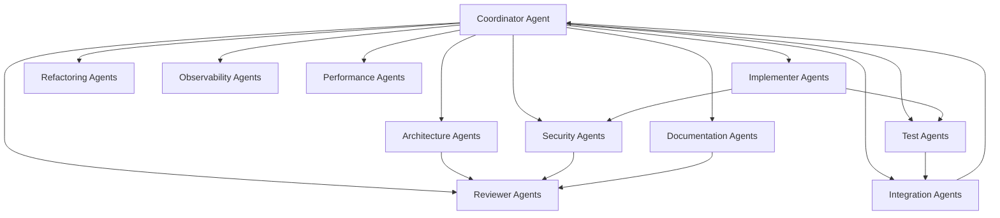
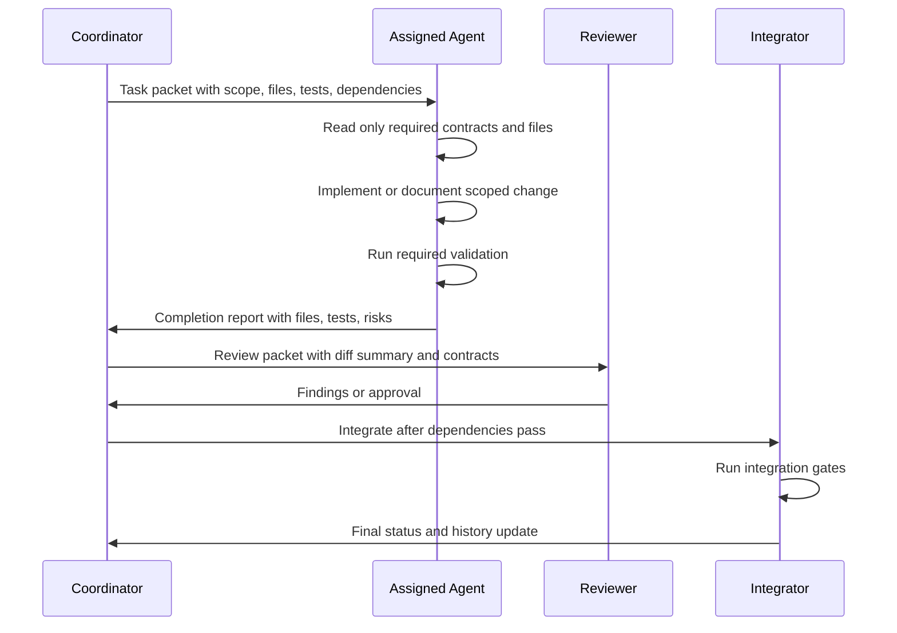
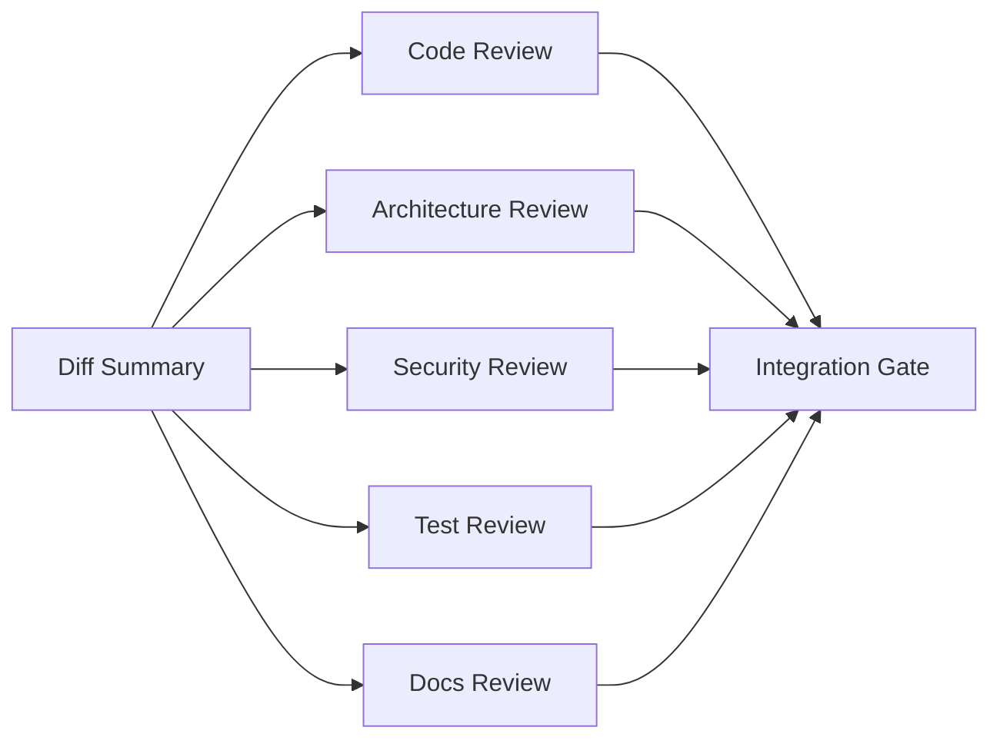

# Multiagent Execution Strategy

Updated: 2026-05-18

This document defines how to execute the production-readiness task files in
this folder with cost-efficient AI agents while preserving SatOIDC's protocol,
security, UI, database, and operational contracts.

Use this as an execution operating model. It is temporary: when the task folder
is retired, summarize the useful durable lessons in `agent-memory/` or
`docs/priority-execution-history.md`.

## Core Principles

- Keep small agents narrow. Cheap agents work well when their inputs, write
  scope, tests, and contracts are explicit.
- Escalate reasoning, not context. Prefer a short escalation packet over giving
  a stronger model the whole repository.
- Contracts first. Any task touching OIDC, OAuth2, LNURL, sessions, secrets,
  migrations, or public URLs must start from the relevant spec or contract.
- One owner per file region. Avoid parallel writes to the same route, service,
  migration, or docs section.
- Integrate continuously. Small patches should pass the relevant local gate
  before another agent builds on them.

## Model Tiers

The exact model names can vary by provider. The execution policy uses three
capability tiers:

| Tier | Use For | Example Recommended Model | Fallback |
| --- | --- | --- | --- |
| Small | docs edits, scoped tests, simple service helpers, link checks, mechanical refactors | `gpt-5.4-mini` | `gpt-5.4` |
| Medium | backend feature slices, NiceGUI UI changes, database queries, integration tests | `gpt-5.4` | `gpt-5.5` |
| Advanced | architecture decisions, auth/OIDC/LNURL/security-sensitive design, migration conflict resolution, conformance triage | `gpt-5.5` | human maintainer review |

Do not use cheap models unsupervised for:

- OIDC/OAuth2 protocol semantics.
- LNURL signature/challenge semantics.
- Secret handling, signing keys, session cookies, or password flows.
- Alembic migrations with data backfill or dialect-specific behavior.
- Cross-cutting refactors touching multiple auth, route, and persistence layers.

## Agent Architecture



## Coordinator Agent

1. Name: `satoidc-coordinator`.
2. Technical specialization: task decomposition, dependency management, context
   minimization, integration planning.
3. Main responsibility: assign task files, enforce write ownership, merge
   outputs, run final checks, and decide escalation.
4. Limits: does not implement large feature slices while coordinating parallel
   agents.
5. Expected inputs: this strategy, `README.md`, `AGENTS.md`, `prd.md`,
   `specs/index.md`, selected task file, latest `git status --short`.
6. Mandatory outputs: assignment brief, dependency map, integration checklist,
   final summary.
7. Allowed dependencies: all task files, relevant specs, agent reports.
8. Autonomy level: high.
9. File modification capability: docs/backlog coordination files only unless
   acting as integrator after agents complete.
10. Maximum context scope: repository indexes plus one phase file and changed
    file summaries.
11. Token reduction strategy: pass agents task-specific file lists instead of
    entire specs; require concise reports.
12. Self-validation strategy: compare assigned work against dependencies and
    write scopes before launch.
13. Communication strategy: short assignment packets and structured completion
    reports.
14. Error recovery strategy: pause dependent tasks, request minimal failing
    diff/test output, reassign or escalate.
15. Escalation criteria: dependency cycle, auth/security ambiguity, migration
    conflict, repeated test failure.
16. Recommended model: `gpt-5.4`.
17. Model justification: coordination requires broad consistency but not always
    frontier-level reasoning.
18. Maximum acceptable complexity: L, but mostly orchestration.
19. Unsupervised risks: agents edit overlapping files or integrate incompatible
    assumptions.
20. Final checklist: dependencies checked; write scopes separated; tests chosen;
    escalation notes recorded; task history updated when completed.

## Specialized Agent Catalog

### 1. `config-contract-agent`

1. Name: `config-contract-agent`.
2. Technical specialization: runtime configuration contracts.
3. Main responsibility: execute Task 0.1 and define current/future env var
   mapping.
4. Limits: documentation and specs only unless explicitly assigned settings
   code.
5. Expected inputs: `specs/contracts/runtime-config.md`,
   `specs/features/setup-wizard/spec.md`, `.env.example`, `compose.yaml`,
   `settings.py`; the completed Phase 0 outcome is summarized in
   `docs/priority-execution-history.md`.
6. Mandatory outputs: variable matrix, precedence rules, changed docs.
7. Allowed dependencies: runtime config spec and setup wizard spec.
8. Autonomy level: medium.
9. File modification capability: docs/specs; no runtime code by default.
10. Maximum context scope: runtime config files only.
11. Token reduction strategy: extract env var table first, then edit only rows
    that differ.
12. Self-validation strategy: verify every variable appears once in the matrix.
13. Communication strategy: report unresolved variable conflicts only.
14. Error recovery strategy: mark ambiguous variables as open questions instead
    of guessing.
15. Escalation criteria: conflict between implemented code and future spec that
    affects production deploys.
16. Recommended model: `gpt-5.4-mini`.
17. Model justification: structured documentation task with bounded files.
18. Maximum acceptable complexity: M.
19. Unsupervised risks: documenting planned variables as implemented.
20. Final checklist: matrix complete; aliases marked; secrets marked; docs
    linked; no behavior claims without code evidence.

### 2. `docs-sync-agent`

1. Name: `docs-sync-agent`.
2. Technical specialization: documentation consistency and traceability.
3. Main responsibility: execute Task 0.2 and keep PRD/specs/memory/backlog
   aligned.
4. Limits: no code edits.
5. Expected inputs: `prd.md`, `docs/known-issues.md`,
   `docs/priority-execution-backlog.md`, `agent-memory/risks.md`,
   `specs/index.md`.
6. Mandatory outputs: synchronized docs and short drift report.
7. Allowed dependencies: docs indexes only.
8. Autonomy level: high for docs.
9. File modification capability: Markdown only.
10. Maximum context scope: five tracking files.
11. Token reduction strategy: use tables of discrepancies, not full doc copies.
12. Self-validation strategy: check no resolved item remains as active risk.
13. Communication strategy: list changed status lines.
14. Error recovery strategy: preserve uncertain items as open questions.
15. Escalation criteria: contradictory source of truth for product readiness.
16. Recommended model: `gpt-5.4-mini`.
17. Model justification: low-risk text reconciliation.
18. Maximum acceptable complexity: S/M.
19. Unsupervised risks: deleting historical context needed for future agents.
20. Final checklist: indexes updated; no orphan Markdown; history/backlog
    lifecycle respected.

### 3. `qa-gates-agent`

1. Name: `qa-gates-agent`.
2. Technical specialization: pytest markers, taskipy commands, CI gates.
3. Main responsibility: execute Task 0.3.
4. Limits: test config and docs only unless marker fixes require test edits.
5. Expected inputs: `satoidc/pyproject.toml`,
   `specs/features/quality-testing/*.md`, `satoidc/tests/`.
6. Mandatory outputs: validated command matrix and any marker fixes.
7. Allowed dependencies: local test tree and pyproject.
8. Autonomy level: medium.
9. File modification capability: test markers, pyproject task definitions, docs.
10. Maximum context scope: test config plus marker search output.
11. Token reduction strategy: use `rg` summaries instead of reading every test.
12. Self-validation strategy: run `poetry run task test` and record skipped
    heavy suites.
13. Communication strategy: report commands run and skipped.
14. Error recovery strategy: isolate one failing marker/command at a time.
15. Escalation criteria: default suite unexpectedly requires Docker/browser or
    many unrelated tests fail.
16. Recommended model: `gpt-5.4-mini`.
17. Model justification: bounded mechanical QA task.
18. Maximum acceptable complexity: M.
19. Unsupervised risks: widening default test suite and slowing all agents.
20. Final checklist: default suite fast; heavy suites isolated; markers
    documented; command output summarized.

### 4. `ops-runbook-agent`

1. Name: `ops-runbook-agent`.
2. Technical specialization: self-hosted operations docs.
3. Main responsibility: execute Tasks 1.1, 1.2, and 1.3 when split by section.
4. Limits: docs only; no Compose or runtime changes unless assigned.
5. Expected inputs: deployment docs, database matrix, runtime contract, and the
   completed Phase 1 operations outcome summarized in
   `docs/priority-execution-history.md`.
6. Mandatory outputs: runbook, email docs, Transit docs, reverse-proxy
   validation updates.
7. Allowed dependencies: operational specs and existing docs.
8. Autonomy level: high for documentation.
9. File modification capability: `docs/operations/`, README/doc indexes.
10. Maximum context scope: one operations topic at a time.
11. Token reduction strategy: use existing docs as templates and write
    procedure checklists.
12. Self-validation strategy: verify every new doc is linked from `docs/README.md`.
13. Communication strategy: report commands/procedures that were not manually
    validated.
14. Error recovery strategy: mark unvalidated procedures clearly.
15. Escalation criteria: production command could destroy data or contradicts
    current Compose/runtime behavior.
16. Recommended model: `gpt-5.4-mini`.
17. Model justification: documentation-heavy task with explicit inputs.
18. Maximum acceptable complexity: M.
19. Unsupervised risks: unsafe backup/restore or misleading security guidance.
20. Final checklist: warnings clear; commands scoped; links updated; no secrets;
    validation status stated.

### 5. `observability-agent`

1. Name: `observability-agent`.
2. Technical specialization: sanitized logging and operational events.
3. Main responsibility: execute Task 1.4.
4. Limits: logging helper and selected instrumentation only.
5. Expected inputs: observability spec, auth/routes/services files, existing
   tests.
6. Mandatory outputs: structured event helper, instrumentation, `caplog` tests.
7. Allowed dependencies: standard `logging` unless a dependency is explicitly
   approved.
8. Autonomy level: medium.
9. File modification capability: auth/routes/services/tests.
10. Maximum context scope: one component group per patch.
11. Token reduction strategy: define taxonomy once, then instrument small slices.
12. Self-validation strategy: run focused tests plus sensitive-value assertions.
13. Communication strategy: publish event names and fields for other agents.
14. Error recovery strategy: disable or narrow instrumentation if it breaks
    behavior; keep sanitization tests.
15. Escalation criteria: uncertainty about logging OAuth/LNURL/security failure
    details without leaks.
16. Recommended model: `gpt-5.4`.
17. Model justification: cross-cutting security-sensitive backend changes need
    stronger reasoning than docs-only work.
18. Maximum acceptable complexity: M/L if sliced.
19. Unsupervised risks: secret leakage or noisy logs that hide incidents.
20. Final checklist: no sensitive values in logs; event fields stable; tests
    pass; docs updated if event contract is public.

### 6. `audit-agent`

1. Name: `audit-agent`.
2. Technical specialization: privileged action auditing.
3. Main responsibility: execute Task 1.5.
4. Limits: admin/client/user mutation audit only.
5. Expected inputs: dashboard route, OAuth client service, permission helpers,
   OIDC key audit reference.
6. Mandatory outputs: audit/log calls and service tests.
7. Allowed dependencies: observability taxonomy and existing models.
8. Autonomy level: medium.
9. File modification capability: services, routes, models if necessary, tests.
10. Maximum context scope: one mutation family per patch.
11. Token reduction strategy: reuse existing audit event style.
12. Self-validation strategy: unit tests for success and failure audit events.
13. Communication strategy: share event names with observability and reviewer
    agents.
14. Error recovery strategy: fall back to operational logs if persistent audit
    model is ambiguous.
15. Escalation criteria: new database schema needed or audit semantics conflict
    with existing key audit.
16. Recommended model: `gpt-5.4`.
17. Model justification: security-adjacent backend logic.
18. Maximum acceptable complexity: M.
19. Unsupervised risks: inconsistent audit history or missing actor/target.
20. Final checklist: actor recorded; target recorded; outcome recorded; no
    secrets; tests cover failure.

### 7. `admin-ui-safety-agent`

1. Name: `admin-ui-safety-agent`.
2. Technical specialization: NiceGUI destructive-action UX.
3. Main responsibility: execute Task 2.1.
4. Limits: delete confirmation UI and related tests.
5. Expected inputs: admin dashboard spec, `dashboard.py`, OAuth client service,
   `DESIGN.md`.
6. Mandatory outputs: typed confirmation dialog and e2e coverage.
7. Allowed dependencies: existing service delete helper.
8. Autonomy level: medium.
9. File modification capability: dashboard route, focused tests.
10. Maximum context scope: delete flow only.
11. Token reduction strategy: inspect only the dialog/function and test fixture.
12. Self-validation strategy: Playwright verifies disabled/enabled states.
13. Communication strategy: report exact confirmation string contract.
14. Error recovery strategy: if e2e is flaky, add focused unit/route coverage and
    report e2e blocker.
15. Escalation criteria: UI state requires broad dashboard refactor.
16. Recommended model: `gpt-5.4-mini` for first pass, `gpt-5.4` fallback.
17. Model justification: scoped UI behavior can use cheap model with tests.
18. Maximum acceptable complexity: S/M.
19. Unsupervised risks: stale UI after deletion or broken owner permissions.
20. Final checklist: button disabled until match; delete refreshes list; tests
    pass; no custom JavaScript.

### 8. `admin-pagination-service-agent`

1. Name: `admin-pagination-service-agent`.
2. Technical specialization: SQLAlchemy query services.
3. Main responsibility: execute Task 2.2.
4. Limits: service-layer pagination, no UI implementation.
5. Expected inputs: dashboard route, models, permission request code, admin
   dashboard spec.
6. Mandatory outputs: pagination DTO/helpers and unit tests.
7. Allowed dependencies: existing services and database session patterns.
8. Autonomy level: medium.
9. File modification capability: `services/`, tests, minimal route adapter if
   needed.
10. Maximum context scope: models plus one dashboard section at a time.
11. Token reduction strategy: define shared DTO, then implement per list.
12. Self-validation strategy: tests for total counts, boundaries, empty page,
    permission scoping.
13. Communication strategy: publish DTO shape to UI agent.
14. Error recovery strategy: keep existing fixed-limit UI while services are
    added behind tests.
15. Escalation criteria: query semantics conflict with admin/developer access.
16. Recommended model: `gpt-5.4`.
17. Model justification: persistence and permission scoping need medium model.
18. Maximum acceptable complexity: M.
19. Unsupervised risks: exposing another user's clients or missing records.
20. Final checklist: DTO stable; scoping tested; counts correct; no route-owned
    commit logic added.

### 9. `admin-pagination-ui-agent`

1. Name: `admin-pagination-ui-agent`.
2. Technical specialization: NiceGUI responsive pagination.
3. Main responsibility: execute Task 2.3.
4. Limits: UI controls and e2e only; no service query changes except adapter use.
5. Expected inputs: pagination DTO contract, `dashboard.py`, `DESIGN.md`,
   Playwright fixtures.
6. Mandatory outputs: responsive controls, empty/error states, e2e tests.
7. Allowed dependencies: Task 2.2 output.
8. Autonomy level: medium.
9. File modification capability: dashboard route, UI components, e2e tests.
10. Maximum context scope: one dashboard section per iteration.
11. Token reduction strategy: work from DTO examples and screenshots/test
    assertions instead of whole route.
12. Self-validation strategy: desktop and mobile Playwright checks.
13. Communication strategy: report UI assumptions back to service agent if DTO
    lacks metadata.
14. Error recovery strategy: degrade to simple previous/next controls before
    adding page-size selectors.
15. Escalation criteria: NiceGUI state model requires route restructuring.
16. Recommended model: `gpt-5.4`.
17. Model justification: UI state and responsive behavior are moderately
    complex.
18. Maximum acceptable complexity: M.
19. Unsupervised risks: clipped controls, inaccessible buttons, stale data.
20. Final checklist: mobile checked; no custom JS; empty/error states present;
    e2e passes or blocker documented.

### 10. `setup-config-agent`

1. Name: `setup-config-agent`.
2. Technical specialization: setup config, `_FILE` secrets, runtime validation.
3. Main responsibility: execute Tasks 3.1 and 3.2.
4. Limits: config resolver/validators only.
5. Expected inputs: setup wizard spec, runtime config contract, `settings.py`,
   `runtime_config.py`.
6. Mandatory outputs: resolver, validators, tests.
7. Allowed dependencies: standard library and existing Pydantic settings.
8. Autonomy level: medium.
9. File modification capability: settings/runtime config/tests.
10. Maximum context scope: config modules and tests only.
11. Token reduction strategy: encode expected cases in a table before editing.
12. Self-validation strategy: unit tests for precedence and production guards.
13. Communication strategy: publish resolver API for bootstrap/wizard agents.
14. Error recovery strategy: keep old env vars working; fail new aliases behind
    explicit tests.
15. Escalation criteria: compatibility choice affects existing production
    deployments.
16. Recommended model: `gpt-5.4`.
17. Model justification: secrets and production startup require careful
    reasoning.
18. Maximum acceptable complexity: M.
19. Unsupervised risks: accepting weak secrets or breaking local defaults.
20. Final checklist: direct env wins; empty files fail; production rejects
    unsafe config; tests pass.

### 11. `setup-db-agent`

1. Name: `setup-db-agent`.
2. Technical specialization: SQLAlchemy models and Alembic migrations.
3. Main responsibility: execute Task 3.3.
4. Limits: setup state model and migration only.
5. Expected inputs: setup wizard spec, database contract, models, migrations.
6. Mandatory outputs: model, autogenerated migration, SQLite/PostgreSQL tests.
7. Allowed dependencies: Alembic autogenerate.
8. Autonomy level: medium.
9. File modification capability: models, migrations, tests.
10. Maximum context scope: database model/migration files only.
11. Token reduction strategy: compare with existing model patterns.
12. Self-validation strategy: run migration/model tests.
13. Communication strategy: publish setup state API fields to bootstrap agents.
14. Error recovery strategy: regenerate migration before manual patching if
    schema drift is detected.
15. Escalation criteria: data migration/backfill or dialect conflict appears.
16. Recommended model: `gpt-5.4`; advanced fallback for migration conflicts.
17. Model justification: migrations need more care than docs but are bounded.
18. Maximum acceptable complexity: M.
19. Unsupervised risks: broken migration chain or dialect-specific failure.
20. Final checklist: autogenerate used; migration reviewed; tests cover SQLite
    and PostgreSQL when possible.

### 12. `setup-bootstrap-agent`

1. Name: `setup-bootstrap-agent`.
2. Technical specialization: root bootstrap and setup state transitions.
3. Main responsibility: execute Tasks 3.4 and 3.5.
4. Limits: non-interactive bootstrap and setup lock only.
5. Expected inputs: config resolver API, setup state model, auth security
   helpers, setup tests.
6. Mandatory outputs: idempotent root bootstrap, concurrency lock, tests.
7. Allowed dependencies: existing password hashing and permission models.
8. Autonomy level: medium with security review.
9. File modification capability: setup wizard package, models/services/tests.
10. Maximum context scope: setup package plus auth password helper.
11. Token reduction strategy: implement state transitions from explicit table.
12. Self-validation strategy: tests for existing admin, missing env, concurrent
    setup, weak password.
13. Communication strategy: report state transition names to UI agent.
14. Error recovery strategy: fail closed and preserve old bootstrap behavior
    until tests are green.
15. Escalation criteria: any path could recreate or overwrite a root account.
16. Recommended model: `gpt-5.4`; advanced fallback for security ambiguity.
17. Model justification: account bootstrap is security-sensitive.
18. Maximum acceptable complexity: M/L if sliced.
19. Unsupervised risks: root account takeover or locked deployments.
20. Final checklist: no root recreation; secrets masked; lock releases on
    failure; tests pass.

### 13. `setup-ui-agent`

1. Name: `setup-ui-agent`.
2. Technical specialization: NiceGUI setup wizard flow.
3. Main responsibility: execute Task 3.6.
4. Limits: interactive setup MVP only; no reconfiguration mode.
5. Expected inputs: completed setup config/bootstrap APIs, setup wizard spec,
   `DESIGN.md`.
6. Mandatory outputs: wizard pages, masked review, apply flow, e2e tests.
7. Allowed dependencies: setup services from backend agents.
8. Autonomy level: medium with integration review.
9. File modification capability: setup wizard UI/routes/tests.
10. Maximum context scope: setup UI files and service API docs.
11. Token reduction strategy: build one wizard step per iteration.
12. Self-validation strategy: Playwright desktop/mobile setup flow.
13. Communication strategy: request explicit service API examples from backend
    agents.
14. Error recovery strategy: disable incomplete optional steps rather than
    storing partial unsafe config.
15. Escalation criteria: public setup exposure or secret display ambiguity.
16. Recommended model: `gpt-5.4`.
17. Model justification: UI plus security state requires medium model.
18. Maximum acceptable complexity: L only when steps are sliced.
19. Unsupervised risks: public setup stays available after completion or secrets
    appear in final review.
20. Final checklist: setup locked after completion; secrets masked; mobile
    checked; no custom JS; tests pass.

### 14. `setup-reconfig-agent`

1. Name: `setup-reconfig-agent`.
2. Technical specialization: authenticated admin reconfiguration.
3. Main responsibility: execute Task 3.7.
4. Limits: reconfiguration only; no secret rotation unless separately specced.
5. Expected inputs: setup UI MVP, page security helpers, audit events.
6. Mandatory outputs: admin-only route, locked env-controlled fields, tests.
7. Allowed dependencies: setup services and audit helper.
8. Autonomy level: low/medium due to security risk.
9. File modification capability: setup UI, auth guards, tests.
10. Maximum context scope: reconfiguration route only.
11. Token reduction strategy: reuse setup MVP components.
12. Self-validation strategy: negative unauthenticated tests and admin e2e.
13. Communication strategy: report high-impact setting changes to security
    reviewer.
14. Error recovery strategy: keep reconfiguration read-only if write semantics
    are unclear.
15. Escalation criteria: changing issuer, signing backend, or database URL from
    UI.
16. Recommended model: `gpt-5.4` with `gpt-5.5` review.
17. Model justification: high-impact config changes need careful review.
18. Maximum acceptable complexity: M per patch.
19. Unsupervised risks: admin UI overwrites env-controlled production settings.
20. Final checklist: auth required; env fields read-only; high-impact confirms;
    audit/log events; tests pass.

### 15. `token-e2e-agent`

1. Name: `token-e2e-agent`.
2. Technical specialization: OAuth/OIDC browser and token lifecycle tests.
3. Main responsibility: execute Task 4.1.
4. Limits: tests and fixtures; no protocol code changes unless fixing a found
   bug after approval.
5. Expected inputs: token lifecycle spec, authorization-code e2e tests,
   existing fixtures.
6. Mandatory outputs: refresh/revocation/introspection/UserInfo e2e coverage.
7. Allowed dependencies: Playwright and existing test server fixture.
8. Autonomy level: medium.
9. File modification capability: e2e tests and fixtures.
10. Maximum context scope: e2e OAuth test files and token spec.
11. Token reduction strategy: reuse existing flow helper and add assertions.
12. Self-validation strategy: run `poetry run task test_e2e`.
13. Communication strategy: report protocol failures separately from flaky test
    failures.
14. Error recovery strategy: isolate into smaller tests if one long flow flakes.
15. Escalation criteria: discovered behavior contradicts OIDC contract.
16. Recommended model: `gpt-5.4`.
17. Model justification: tests encode protocol expectations.
18. Maximum acceptable complexity: M.
19. Unsupervised risks: brittle e2e tests or incorrect protocol expectations.
20. Final checklist: old refresh invalid; revoked token invalid; UserInfo scope
    checked; e2e result reported.

### 16. `lnurl-contract-agent`

1. Name: `lnurl-contract-agent`.
2. Technical specialization: LNURL-auth semantics.
3. Main responsibility: execute Task 4.2.
4. Limits: `action=auth` decision and matching tests.
5. Expected inputs: LNURL route/auth code, LNURL flow spec, LNURL tests.
6. Mandatory outputs: documented decision and code/test alignment.
7. Allowed dependencies: existing LNURL helpers.
8. Autonomy level: low/medium.
9. File modification capability: LNURL code/spec/tests.
10. Maximum context scope: LNURL files only.
11. Token reduction strategy: search only for `action=auth` and related action
    dispatch.
12. Self-validation strategy: LNURL tests and route negative cases.
13. Communication strategy: provide exact contract change to security reviewer.
14. Error recovery strategy: mark action experimental/disabled if semantics are
    unclear.
15. Escalation criteria: signature, replay, or wallet compatibility ambiguity.
16. Recommended model: `gpt-5.5` for decision; `gpt-5.4` for implementation.
17. Model justification: auth protocol semantics are high-risk.
18. Maximum acceptable complexity: M.
19. Unsupervised risks: weakening replay defense or breaking wallet flows.
20. Final checklist: spec updated; tests cover action; challenge consumption
    unchanged unless explicitly approved.

### 17. `conformance-agent`

1. Name: `conformance-agent`.
2. Technical specialization: OpenID Foundation Basic OP evidence.
3. Main responsibility: execute Tasks 4.3 and 4.4.
4. Limits: conformance environment and docs; protocol fixes require separate
   task.
5. Expected inputs: OIDC conformance spec, OIDC contract, deployment docs.
6. Mandatory outputs: reproducible setup and `docs/conformance.md` evidence.
7. Allowed dependencies: disposable local/remote test instance.
8. Autonomy level: medium.
9. File modification capability: docs, optional examples/scripts.
10. Maximum context scope: OIDC contract, deployment setup, conformance output.
11. Token reduction strategy: summarize conformance failures by test id and
    affected endpoint.
12. Self-validation strategy: smoke discovery/JWKS/auth/token/UserInfo before
    running suite.
13. Communication strategy: file product bugs as follow-up specs, not ad hoc
    broad patches.
14. Error recovery strategy: if suite setup fails, produce a reproducible
    blocker report.
15. Escalation criteria: failure indicates protocol behavior mismatch.
16. Recommended model: `gpt-5.4`; advanced fallback for failure triage.
17. Model justification: environment setup is bounded, failure triage may need
    stronger reasoning.
18. Maximum acceptable complexity: L for triage, M for docs.
19. Unsupervised risks: claiming conformance without evidence.
20. Final checklist: date/profile/config recorded; secrets disposable; failures
    linked to follow-up tasks.

### 18. `performance-agent`

1. Name: `performance-agent`.
2. Technical specialization: Locust and token endpoint load baseline.
3. Main responsibility: execute Task 4.5.
4. Limits: load tests and docs; no optimization changes unless separately
   assigned.
5. Expected inputs: load spec, `tests/load/locustfile.py`, deployment/runtime
   docs.
6. Mandatory outputs: scenario updates and documented baseline.
7. Allowed dependencies: PostgreSQL test environment.
8. Autonomy level: medium.
9. File modification capability: load tests and performance docs.
10. Maximum context scope: load test and token endpoint contract.
11. Token reduction strategy: record numeric results in compact tables.
12. Self-validation strategy: run bounded `poetry run task test_load`.
13. Communication strategy: distinguish environment limit from app limit.
14. Error recovery strategy: if load env unavailable, produce setup blocker and
    keep scenario deterministic.
15. Escalation criteria: app failures under low load suggest concurrency bug.
16. Recommended model: `gpt-5.4-mini` for scenario/docs, `gpt-5.4` for failures.
17. Model justification: measurements are procedural unless failures occur.
18. Maximum acceptable complexity: M.
19. Unsupervised risks: publishing misleading laptop/SQLite numbers.
20. Final checklist: PostgreSQL noted; p95/failure rate/request count recorded;
    secrets redacted; load not in default suite.

### 19. `compatibility-agent`

1. Name: `compatibility-agent`.
2. Technical specialization: relying-party examples and compatibility matrix.
3. Main responsibility: execute Task 5.1.
4. Limits: docs/examples only for selected integrations.
5. Expected inputs: relying-party flow spec, examples folder, OIDC contract,
   conformance docs.
6. Mandatory outputs: matrix and at least one verified example.
7. Allowed dependencies: local example clients.
8. Autonomy level: medium.
9. File modification capability: examples and docs.
10. Maximum context scope: one relying-party stack at a time.
11. Token reduction strategy: use a fixed template per integration.
12. Self-validation strategy: run or manually verify the selected example.
13. Communication strategy: mark status as tested, documented, or pending.
14. Error recovery strategy: reduce to one integration if matrix grows too wide.
15. Escalation criteria: integration failure indicates OIDC contract mismatch.
16. Recommended model: `gpt-5.4-mini`; `gpt-5.4` fallback for debugging.
17. Model justification: repetitive docs/config work.
18. Maximum acceptable complexity: M.
19. Unsupervised risks: stale or unverified examples.
20. Final checklist: client type; auth method; redirect URI; scopes; claims;
    status.

### 20. `metrics-spec-agent`

1. Name: `metrics-spec-agent`.
2. Technical specialization: metrics taxonomy and privacy.
3. Main responsibility: execute Task 5.2.
4. Limits: metrics spec only; no exporter implementation.
5. Expected inputs: observability spec and structured logging output.
6. Mandatory outputs: metric names, labels, cardinality rules, privacy limits.
7. Allowed dependencies: OpenTelemetry/Prometheus concepts only as design
   background.
8. Autonomy level: medium.
9. File modification capability: specs/docs only.
10. Maximum context scope: observability docs and event taxonomy.
11. Token reduction strategy: table-driven metric specification.
12. Self-validation strategy: review for high-cardinality labels and sensitive
    fields.
13. Communication strategy: publish forbidden labels for future implementers.
14. Error recovery strategy: defer ambiguous metric to future open question.
15. Escalation criteria: metrics imply public endpoint security decisions.
16. Recommended model: `gpt-5.4-mini`; `gpt-5.4` fallback for privacy review.
17. Model justification: bounded design doc.
18. Maximum acceptable complexity: M.
19. Unsupervised risks: privacy leak through labels or cardinality explosion.
20. Final checklist: no user/client/ip high cardinality without justification;
    `/metrics` exposure documented; implementation deferred.

## Responsibility Matrix

| Area | Primary Agent | Reviewer | Model Tier |
| --- | --- | --- | --- |
| Runtime config contract | `config-contract-agent` | `satoidc-coordinator` | Small |
| Docs synchronization | `docs-sync-agent` | `satoidc-coordinator` | Small |
| Test gates | `qa-gates-agent` | `integration-agent` | Small |
| Operations docs | `ops-runbook-agent` | `security-review-agent` | Small |
| Structured logs | `observability-agent` | `security-review-agent` | Medium |
| Admin audit | `audit-agent` | `security-review-agent` | Medium |
| Client delete UI | `admin-ui-safety-agent` | `code-review-agent` | Small/Medium |
| Pagination services | `admin-pagination-service-agent` | `architecture-review-agent` | Medium |
| Pagination UI | `admin-pagination-ui-agent` | `ui-review-agent` | Medium |
| Setup config | `setup-config-agent` | `security-review-agent` | Medium |
| Setup database | `setup-db-agent` | `database-review-agent` | Medium |
| Setup bootstrap | `setup-bootstrap-agent` | `security-review-agent` | Medium/Advanced |
| Setup UI | `setup-ui-agent` | `security-review-agent` | Medium |
| LNURL contract | `lnurl-contract-agent` | `architecture-review-agent` | Advanced |
| OIDC lifecycle tests | `token-e2e-agent` | `contract-review-agent` | Medium |
| OIDC conformance | `conformance-agent` | `contract-review-agent` | Medium/Advanced |
| Load baseline | `performance-agent` | `performance-review-agent` | Small/Medium |
| Compatibility docs | `compatibility-agent` | `contract-review-agent` | Small/Medium |
| Metrics spec | `metrics-spec-agent` | `observability-agent` | Small/Medium |

## Dependency Matrix

| Task | Depends On | Can Run In Parallel With |
| --- | --- | --- |
| 0.1 config namespace | none | 0.2, 0.3 |
| 0.2 docs sync | none | 0.1, 0.3 |
| 0.3 test gates | none | 0.1, 0.2 |
| 1.1 runbook | 0.1 recommended | 1.2, 1.3 |
| 1.2 reverse proxy | none | 1.1, 1.3 |
| 1.3 email/transit docs | 0.1 recommended | 1.1, 1.2 |
| 1.4 structured logs | 0.1 optional | 2.1, 4.1 |
| 1.5 audit | 1.4 recommended | 2.2 |
| 2.1 delete confirmation | none | 1.4, 4.1 |
| 2.2 pagination services | none | 1.5 |
| 2.3 pagination UI | 2.2 | 3.x backend tasks |
| 3.1 `_FILE` resolver | 0.1 | 1.x docs |
| 3.2 runtime validation | 3.1 recommended | 4.1 |
| 3.3 setup state | 3.2 | 4.5 |
| 3.4 root bootstrap | 3.1, 3.3 | 2.x |
| 3.5 setup lock | 3.3 | 3.4 |
| 3.6 setup UI | 3.1-3.5 | 4.3 |
| 3.7 reconfiguration | 3.6, 1.5 recommended | 5.x |
| 4.1 token e2e | 0.3 | 1.x, 2.x |
| 4.2 LNURL contract | none | 4.1 |
| 4.3 conformance env | 4.1 recommended | 4.5 |
| 4.4 conformance evidence | 4.3 | 5.1 |
| 4.5 load baseline | 0.3 | 4.3 |
| 5.1 compatibility | 4.4 recommended | 5.2 |
| 5.2 metrics spec | 1.4 recommended | 5.1 |

## Execution Flow



## Communication Flow

Agents report in a compact format:

```text
Task:
Files changed:
Commands run:
Contracts checked:
Assumptions:
Risks:
Blocked by:
Next handoff:
```

Agents should not paste full files or long logs. They should report failing test
names, error class, and the smallest relevant excerpt.

## Review Flow



Review agents:

- `architecture-review-agent`: checks service boundaries, Authlib sync boundary,
  NiceGUI routing style, and avoidance of broad rewrites.
- `security-review-agent`: checks secrets, sessions, redirects, LNURL replay,
  OIDC signing, audit, and log leakage.
- `performance-review-agent`: checks load methodology, database assumptions,
  and misleading capacity claims.
- `code-review-agent`: checks bugs, regression risks, style, and test gaps.
- `contract-review-agent`: checks OIDC/OAuth2/LNURL/runtime/database contract
  compatibility.
- `test-review-agent`: checks marker selection, fixtures, determinism, and
  coverage relevance.
- `docs-review-agent`: checks discoverability, accuracy, and lifecycle rules.

Use small models for docs and basic code review. Use medium models for backend
review. Use advanced models for security/protocol/migration review.

## Integration Flow

1. Confirm `git status --short` and identify unrelated user changes.
2. Apply only one task output at a time.
3. Run the task-specific validation command.
4. Run `cd satoidc; poetry run task test` after code changes unless clearly
   irrelevant.
5. Run `poetry run task lint` before commit-ready integration.
6. For UI changes, run `poetry run task test_e2e` or document why skipped.
7. For migrations, run migration-specific SQLite/PostgreSQL checks.
8. Update docs indexes and task history.
9. Remove completed task files only after their outcomes are summarized.

## Context Strategy

Agents receive context in layers:

1. Always include: `AGENTS.md` summary, selected task file, relevant specs.
2. Include only when needed: PRD sections, architecture doc, contracts,
   examples, tests.
3. Avoid by default: full repository dumps, unrelated specs, old reports,
   generated files, local databases.

Use source types as follows:

- PRD: product priority, acceptance intent, production-readiness gaps.
- SPEC: detailed behavior and test expectations.
- ADRs/decisions: accepted tradeoffs and historical constraints.
- API contracts: endpoint behavior, request/response expectations, token and
  claim semantics.
- Diagrams: request flow and component orientation only.
- Schemas/models: persistence and validation source of truth.
- Conventions: `AGENTS.md`, `DESIGN.md`, `CONTRIBUTING.md`, `pyproject.toml`.
- Templates/examples: replicate local style, not external patterns.
- Memory summaries: stable pitfalls, validated commands, open questions.

## Token Economy Strategy

Use small models for:

- task-file cleanup;
- docs index updates;
- runbook sections with explicit source files;
- marker audits;
- simple e2e assertion additions;
- compatibility matrix entries;
- metrics spec tables.

Use medium models for:

- service-layer pagination;
- NiceGUI stateful UI;
- setup config resolver;
- setup bootstrap;
- observability instrumentation;
- token lifecycle tests;
- migration creation with simple schema.

Use advanced models for:

- LNURL action semantics;
- OIDC conformance failure triage;
- root account bootstrap security disputes;
- signing key or Transit changes;
- migration conflicts or data backfills;
- architecture decisions that alter public contracts.

Reduce tokens by:

- assigning one task file at a time;
- using `rg` and summaries before reading files;
- passing DTO/API summaries between agents;
- using short completion reports;
- creating handoff notes instead of replaying full diffs;
- storing durable decisions in `agent-memory/`;
- requiring agents to read indexes before broad files.

Avoid reprocessing by:

- updating task status in the task file or backlog;
- adding completion summaries to history;
- reusing test command outputs as summarized evidence;
- assigning clear write ownership;
- having the coordinator maintain a dependency board.

## Quality Strategy

Avoid architecture drift:

- route modules compose UI and translate errors;
- persistence-heavy logic belongs in services;
- Authlib database operations remain behind the sync session boundary and
  threadpool helpers;
- NiceGUI changes follow `DESIGN.md`;
- contracts are updated before behavior changes.

Guarantee standardization:

- use existing helpers in `auth/`, `services/`, `models/`, and `validators.py`;
- use existing pytest marker conventions;
- use existing audit/log patterns;
- use Alembic autogenerate for schema changes.

Guarantee API consistency:

- contract-review-agent checks OIDC discovery, JWKS, token, UserInfo,
  introspection, revocation, LNURL callback, and runtime config changes.

Guarantee security:

- security-review-agent reviews all changes touching auth, redirects, cookies,
  secrets, signing, sessions, migrations, admin actions, and logs.

Guarantee coverage:

- every code task names required tests before implementation;
- skipped tests are reported with reason and residual risk.

Guarantee traceability:

- task file -> spec/contract -> diff -> tests -> history summary.

## Pipeline Strategies

### Backend Pipeline

1. Read task file and related contract.
2. Identify service/helper boundary.
3. Add or update tests first when feasible.
4. Implement small service slice.
5. Run focused tests.
6. Run default suite.
7. Request code/security review if auth or persistence is touched.

### Frontend Pipeline

1. Read `DESIGN.md` and relevant route.
2. Define UI state contract.
3. Implement with NiceGUI-native APIs.
4. Add e2e or route-level checks.
5. Verify desktop/mobile where meaningful.
6. Avoid custom JavaScript unless explicitly approved.

### Infrastructure Pipeline

1. Read deployment docs and runtime contract.
2. Update docs or Compose in a minimal patch.
3. Validate commands in disposable environment when possible.
4. Document unvalidated assumptions.

### Database Pipeline

1. Confirm schema need from spec.
2. Update SQLAlchemy model.
3. Generate Alembic migration with autogenerate.
4. Review migration for dialect compatibility.
5. Run migration tests.
6. Do not rewrite existing migrations.

### Security Pipeline

1. Identify sensitive data and trust boundary.
2. Add negative tests.
3. Implement fail-closed behavior.
4. Add log-leakage assertions.
5. Require security review.

### Test Pipeline

1. Select test tier.
2. Keep default test suite fast.
3. Mark e2e/integration/load correctly.
4. Use deterministic fixtures and `freezegun` for time-sensitive behavior.
5. Report exact command output summary.

### Review Pipeline

1. Review findings first, ordered by severity.
2. Use file/line references.
3. Identify missing tests.
4. Escalate only unresolved high-impact ambiguity.

### Deploy Pipeline

1. Validate runtime config.
2. Confirm migrations at head.
3. Confirm reverse proxy/TLS/rate limits.
4. Confirm secrets are not placeholders.
5. Confirm health checks and rollback notes.

### Observability Pipeline

1. Define event taxonomy.
2. Instrument one component at a time.
3. Add sanitization tests.
4. Document event fields.
5. Defer metrics exporter until metrics spec is approved.

## Branching And Versioning Strategy

Branch naming must follow repository convention, not the default Codex prefix:

- `docs/multiagent-execution-strategy`
- `docs/operator-runbooks`
- `feat/setup-config-resolution`
- `feat/setup-bootstrap`
- `feat/admin-dashboard-pagination`
- `test/token-lifecycle-e2e`
- `perf/token-load-baseline`

Commit strategy:

- Use Conventional Commits in English.
- Keep commits atomic by task file.
- Include `Assisted-by: Codex:GPT-5.5` or equivalent AI assistance trailer when
  meaningful assistance is used.
- Do not add `Signed-off-by:` from an AI agent.

Versioning checkpoints:

| Checkpoint | Required Evidence |
| --- | --- |
| C0 Foundation | config/backlog/test gates aligned |
| C1 Self-hosted MVP docs | runbook, proxy, email, Transit docs linked |
| C2 Admin hardening | destructive confirmation and pagination tests |
| C3 Setup bootstrap | `_FILE`, setup state, root bootstrap tests |
| C4 Setup UI | interactive wizard e2e |
| C5 Protocol evidence | token lifecycle e2e and conformance docs |
| C6 Production baseline | load baseline and compatibility matrix |

## Anti-Chaos Mechanisms

- Duplicate code prevention: agents must search for existing helpers before
  adding new abstractions.
- Contract protection: any public behavior change must update specs first or in
  the same patch.
- PR conflict prevention: one active writer per hot file, especially
  `dashboard.py`, `settings.py`, migrations, and OAuth/LNURL route files.
- Regression prevention: focused tests plus default suite after code changes.
- Coupling prevention: route code must not regain persistence-heavy logic.
- Documentation drift prevention: every new Markdown file must be linked from
  an index.
- Security drift prevention: all auth/session/secret/OIDC/LNURL changes require
  security review and negative tests.

## Mandatory Agent Final Checklist

Every subagent must complete this checklist before handoff:

- Task file and relevant specs read.
- Write scope respected.
- Existing helpers searched before adding new code.
- Contracts updated or confirmed unchanged.
- Tests added or skip reason documented.
- Required commands run or blocker recorded.
- Sensitive values not logged or documented.
- Docs/indexes updated for new Markdown.
- Completion report includes files changed, tests run, risks, and next handoff.
