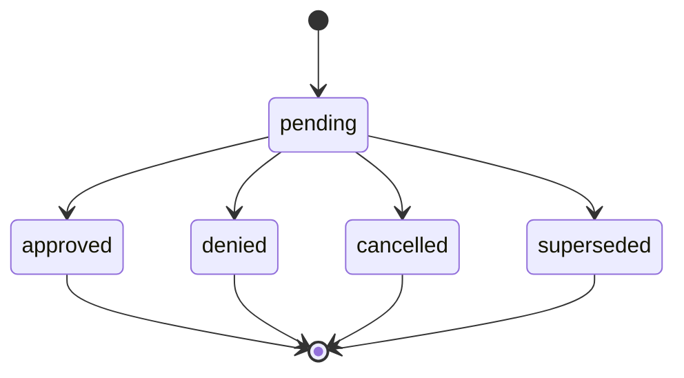

# Permission Requests Design

## Domain Model

`PermissionRequest` represents a user's request to receive a permission.

Recommended fields:

| Field | Type | Notes |
| --- | --- | --- |
| `id` | integer or UUID | Primary key. |
| `requester_id` | UUID | References `users.id`. |
| `permission_type` | string/enum | Initially `developer`. |
| `status` | string/enum | `pending`, `approved`, `denied`, `cancelled`, `superseded`. |
| `reason` | text nullable | User-provided request reason. |
| `decision_reason` | text nullable | Admin-provided decision note. |
| `decided_by` | UUID nullable | References admin/root `users.id`. |
| `decided_at` | datetime nullable | Set when approved or denied. |
| `created_at` | datetime | Server default. |
| `updated_at` | datetime | Updated on mutation. |

## State Machine

Only `pending` is actionable by admins.

## Permission Granting

Approval should create or enable a `Permission` row for the requester.

Expected behavior:

- If the user already has an active matching permission, mark the request
  approved or superseded without creating a duplicate permission.
- If a disabled matching permission exists, either create a fresh permission or
  re-enable the existing permission. Choose one behavior and test it.
- If permission grant fails, keep the request pending and surface an error.

## Profile UX

States:

- No developer access and no pending request: show request button.
- Pending request: show pending state, request timestamp, and optional cancel.
- Denied request: show denial state and reason, plus request-again behavior if
  allowed.
- Approved or direct permission: show developer dashboard link.

The user action should not say "sent" until the database commit succeeds.

## Admin UX

Top summary:

- Pending requests.
- Approved this week.
- Denied this week.
- Developer users.
- Registered clients.

Primary table:

- Requester.
- Requested permission.
- Reason preview.
- Created at / age.
- Status.
- Decision metadata.
- Actions.

Tabs:

- Pending.
- Approved.
- Denied.
- All.

Actions:

- Approve.
- Deny.
- Open requester profile.
- Copy requester identifier.

Notifications:

- The top bar can show a badge or count when pending requests exist.
- The admin dashboard should show the pending count even when the request table
  is filtered away from pending.

## Security

- Only admins/root can view all permission requests.
- Requesters can view their own requests but not others.
- Approval/denial must be server-side authorized.
- Request and decision notes must be rendered as plain text.
- Admin dashboard must not expose password hashes, client secrets, session ids,
  LNURL secrets, or OAuth tokens.
